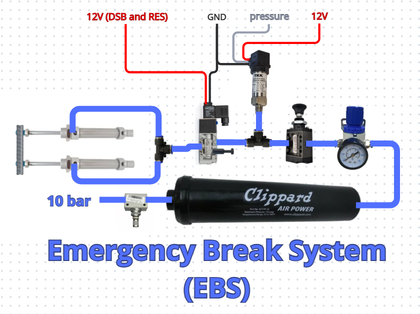

# Emergency Brake System

## Description

The **Emergency Braking System (EBS)** is responsible for applying the brake pedal when necessary. It is controlled by the **Driverless System Brake (DSB)** and **Remote Emergency System (RES)** boards.

The system consists of a compressed-air storage tank rated at approximately 8 bar, a pressure regulator with a pressure gauge, two manual valves (one threaded valve and one push-button valve), a pressure sensor, a normally-open pneumatic solenoid valve, two pneumatic cylinders, mounting hardware, a steel container, and 1/4" pneumatic hoses.

The system is designed to provide sufficient pressure to the cylinders to pull the car's brake pedal when power to the pneumatic solenoid valve is interrupted.

The EBS assembly is not permanently installed on the car. The steel container is bolted to the inside of the car's nose and the pistons to the pedal when autonomous operation is required and is removed when the car is operated in manual mode.

The pneumatic system starts with the threaded manual valve, followed by the air tank, pressure regulator, and push-button manual valve. This arrangement allows the tank to be isolated from the rest of the system and its pressure to be regulated during refilling, preventing the system from exceeding the 10 bar operating specification of the pneumatic hoses.

Next, a pressure sensor is used to monitor the system pressure. If the pressure falls below the minimum required to actuate the brakes, the car enters emergency mode and shuts down the Tractive System (TS).

After the pressure sensor, the system has a **normally-open solenoid valve**. It only blocks the air supply when energized. This is a safety feature: if the car loses power for any reason, the EBS must still be able to apply the brakes. When either the RES or DSB needs to activate the EBS, it does so by cutting power to the solenoid valve through a relay.

Finally, the pneumatic cylinders pull the brake pedal through a threaded rod connected to the pedal. Two cylinders are used for redundancy, as required by the regulations.

## Routine for Filling the Tank

The procedure for filling the air tank is as follows:

* Open the threaded manual valve to release all pressure from the system.
* Close the push-button manual valve, preventing pressure from the tank from reaching the rest of the system.
* Connect the tank's filling hose to a suitable pressure source.
* Check the pressure using the pressure gauge and adjust it if necessary.
* Close the threaded valve.
* Disconnect the pressure source.

## Turning On the System in the Car

When the EBS is going to be used, first turn the **ASMS** key and wait for the autonomous system to initialize. Once the system is fully operational, power to the solenoid valve is already active.

The push-button manual valve can then be opened to pressurize the system. The brake pedal remains in its normal position while the system is pressurized and is only pulled when the solenoid valve is de-energized.

## Inputs

* 12 V (switched by the DSB and RES in series)
* 10 bar compressed air (during tank filling)

The 12 V supply for the solenoid valve is provided by the DSB and RES in series. This allows either system to independently activate the EBS by interrupting the solenoid's power supply.

The 10 bar pressure source is only connected to the system while filling the air tank. Once the tank has been pressurized, the external pressure source is disconnected according to the filling procedure described above.

## Outputs

* 8–10 bar (to the pneumatic cylinders)
* pressure

This pressure range is required for the cylinders to pull the brake pedal all the way to its actuated position. Air pressure is only supplied to the brake cylinders when power to the solenoid valve is interrupted, either by the boards responsible for EBS activation (DSB and RES) or by a loss of power in the car's low-voltage system. The pressure is the actual pressure of the system mesuared by the pressure sensor.
