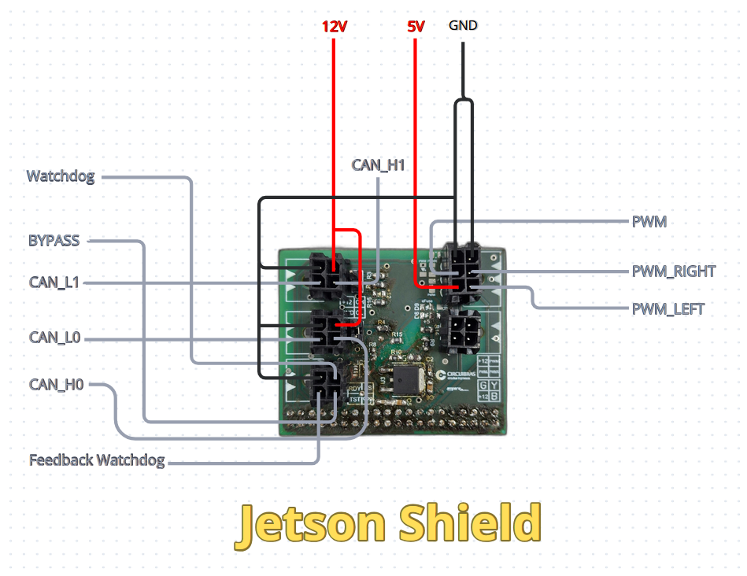

# Hardware integration

## Jetson Shield
The “Jetson shield” is designed to serve as an interface between our computing unit and the vehicle’s CAN bus. The CAN signals are received by a CAN transceiver on the board, which converts the electrical signals between the CAN bus and the computing unit’s interface, enabling communication with the vehicle’s systems.

### Inputs

The communication architecture of the “AMP” utilizes two CAN buses (CAN_0 and CAN_1), each assigned to specific functions:

**CAN_0:** This bus is used to transmit various data acquired from the vehicle’s sensors, such as IMU and steering measurements. All sensor-acquired data is transmitted via the CAN bus.

**CAN_1:** This bus is used for communication with the vehicle’s inverter ECU. It is reserved for the exchange of information essential to the vehicle’s operation and for communication with the ECU.

**Watchdog Feedback:** This is a 3V3 voltage signal used by the Jetson to monitor whether the EBS watchdog system is operating correctly.

### Outputs

The **PWM Left** and **PWM Right** signals control the direction of motor rotation. These are binary control signals, with each signal indicating the direction in which the motor is commanded to rotate.

The **BYPASS** signal is an auxiliary signal used during the system’s initial check. It allows the initial verification procedure to be performed while the watchdog signal is inactive and reserved for its regular monitoring routine.

The **Watchdog** signal is a periodic signal transmitted to verify that the system is operating correctly. If the expected Watchdog signal is not detected within the specified time interval, the system interprets this condition as a fault.
