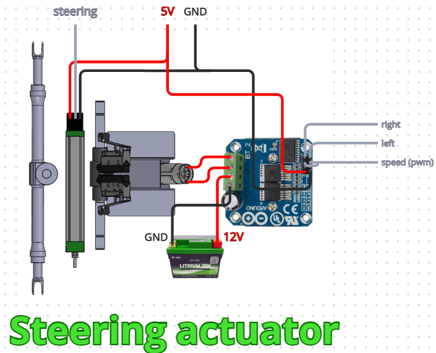

# Steering Actuator

The **steering actuator** is responsible for positioning the front wheels at the desired steering angle. It consists of a DC motor coupled to a 1:256 planetary gearbox, which is welded to a steering box. The motor is controlled by an H-bridge, allowing the system to control both its direction and speed of rotation.

The actuator assembly is mounted to the chassis using a steel-sheet bracket. During autonomous operation, the bracket is bolted to the chassis, allowing the actuator to control the steering system. When the car is driven by a pilot, the actuator is unbolted and removed from the steering system.

The system also features two **end switches** for detecting the actuator's mechanical limits. These switches were not implemented in the 226 prototype.

## Inputs

- Right
- Left
- Speed [PWM]

The **Right** and **Left** signals determine the direction of motor rotation. They are **binary** signals, with each input indicating whether the motor should rotate in one of the two possible directions.

The **Speed** signal controls the motor speed and is provided as a **PWM** signal.

## Outputs

- Steering

The **Steering** signal represents the current steering angle of the wheels, measured using a linear position sensor. It is provided as an **analog** signal.