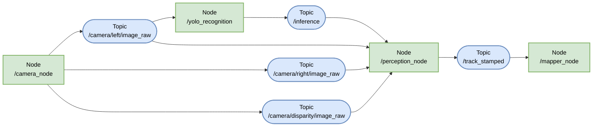
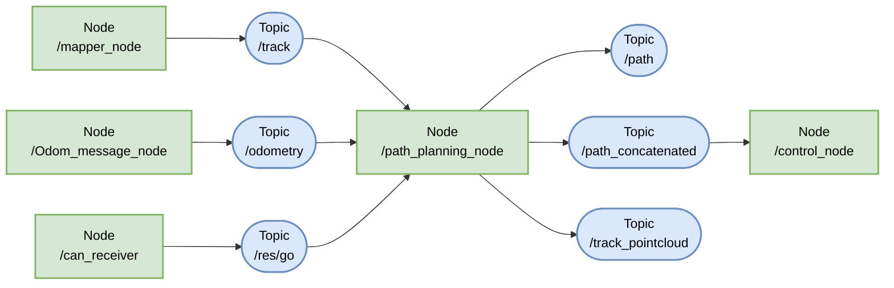
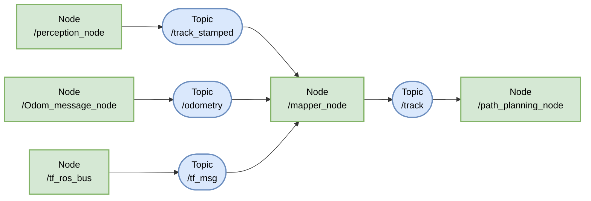
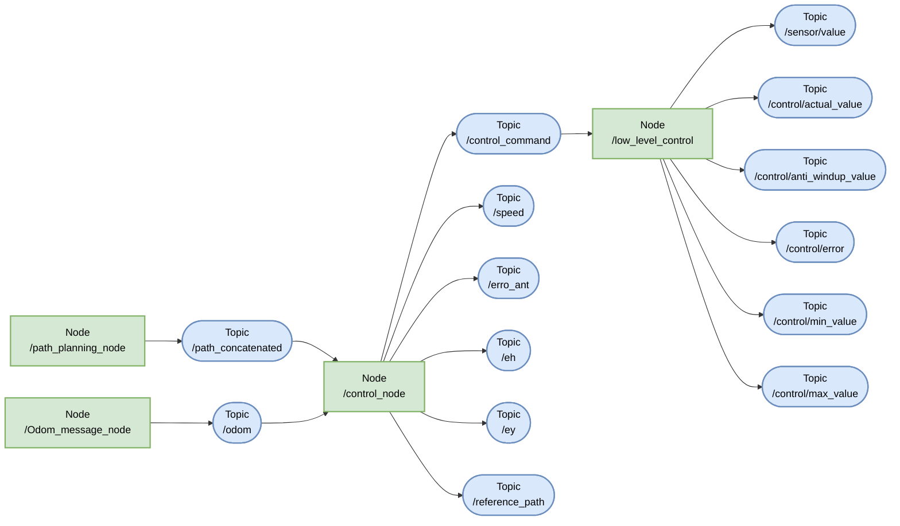
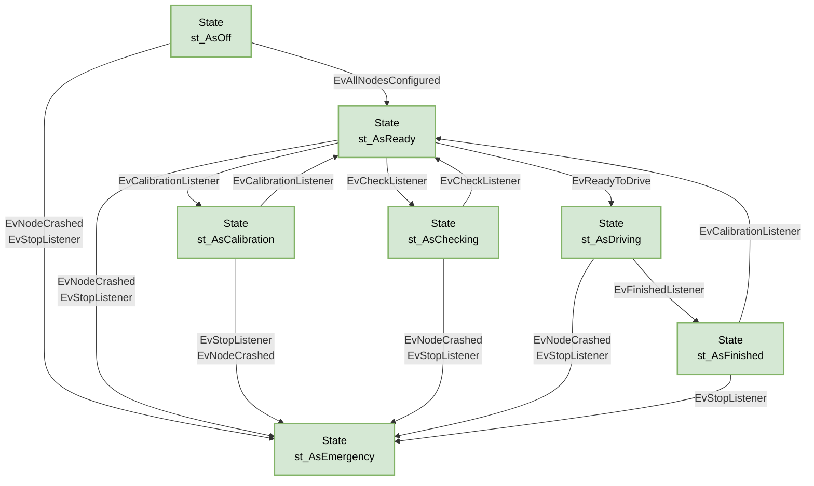
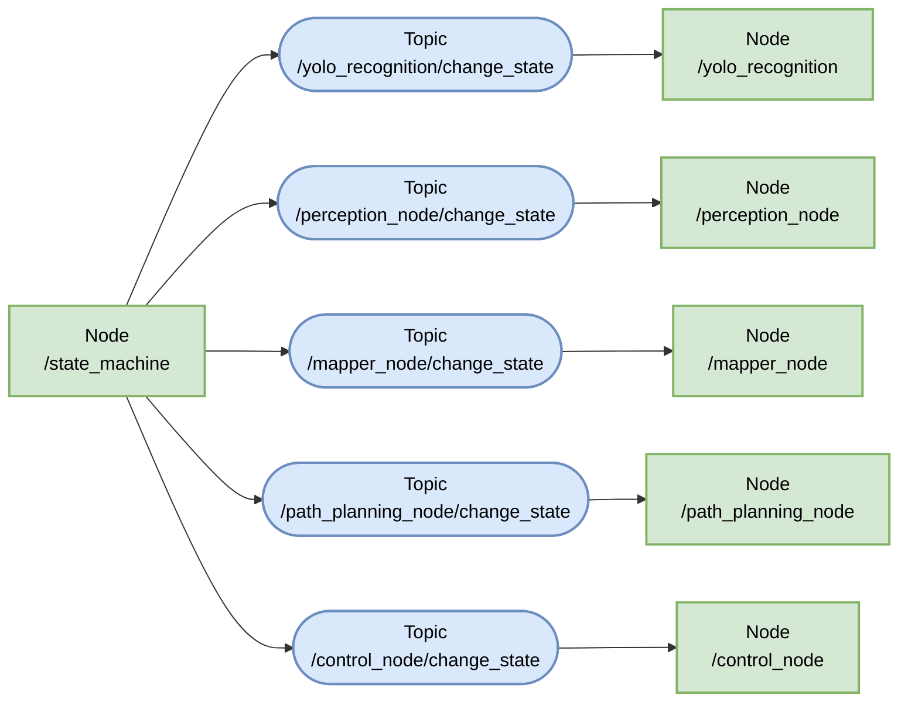

# Software overview

## Perception

## Mapper

## Path Planning

## Mapper

## Control

## State Machine

- It highlights all possible states and the specific events responsible for state transitions.

- The following section demonstrates the state machine's operation across the system.

